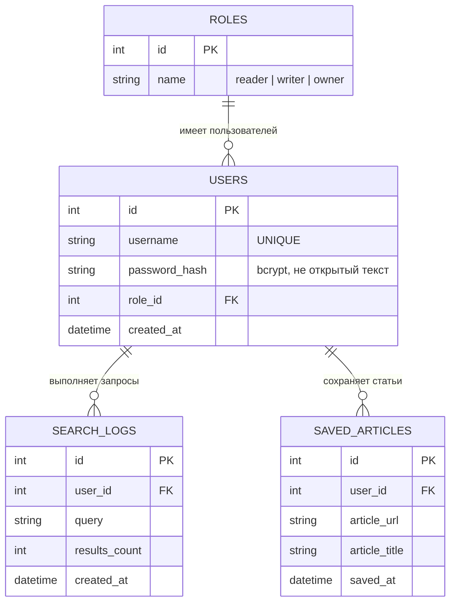

# ER-диаграмма

Реляционная часть проекта (SQLite, `data/searcher.db`) отвечает за
пользователей, роли, аудит поиска и избранное. Полнотекстовый поиск по
статьям — отдельный документный индекс в Elasticsearch (`articles`), не
реляционная СУБД, поэтому в ER-диаграмму не входит; его схема описана в
`app/schemas.py::Document` и `scripts/indexer.py::MAPPING`.

## Диаграмма (mermaid)

## Сущности и связи

| Сущность | Первичный ключ | Внешние ключи | Назначение |
|---|---|---|---|
| `roles` | `id` | — | Справочник ролей: `reader`, `writer`, `owner` |
| `users` | `id` | `role_id → roles.id` | Учётные записи, пароли хранятся хэшами |
| `search_logs` | `id` | `user_id → users.id` | Аудит: кто, что и когда искал |
| `saved_articles` | `id` | `user_id → users.id` | Избранные статьи пользователя |

Связи:
- `roles 1:N users` — одна роль назначена многим пользователям, у пользователя ровно одна роль.
- `users 1:N search_logs` — один пользователь может выполнить много поисковых запросов, каждый лог принадлежит одному пользователю (это и есть обязательная связь «Заявка ← История» из критериев оценки: здесь роль «заявки» играет пользователь, а «истории» — `search_logs`).
- `users 1:N saved_articles` — один пользователь может сохранить много статей.

## Почему так, а не иначе

- `roles` вынесена в отдельную таблицу (а не enum-строка в `users`), чтобы связь
  была видна как полноценная 1:N и роли можно было администрировать без миграции
  кода (например, добавить новую роль).
- `search_logs` и `saved_articles` — раздельные таблицы, а не одна
  универсальная «events»-таблица: у них разное назначение (аудит vs
  пользовательские данные) и разные наборы полей — совмещать их значило бы
  городить нуллable-колонки под разные смыслы.
- Статьи не хранятся в SQL: они живут в Elasticsearch как основной источник
  полнотекстового поиска. `saved_articles` хранит лишь ссылку (`article_url`)
  и заголовок — этого достаточно, чтобы показать «избранное» пользователю, без
  дублирования полного текста статьи в двух хранилищах.
